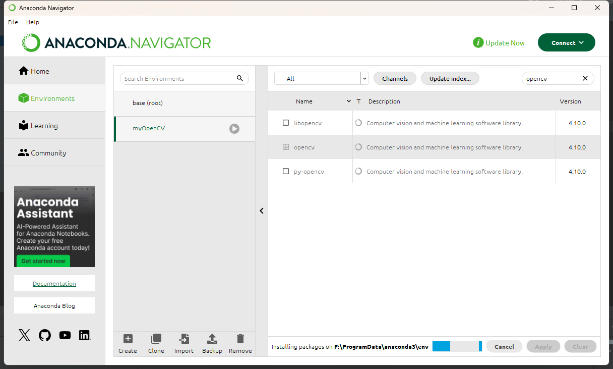
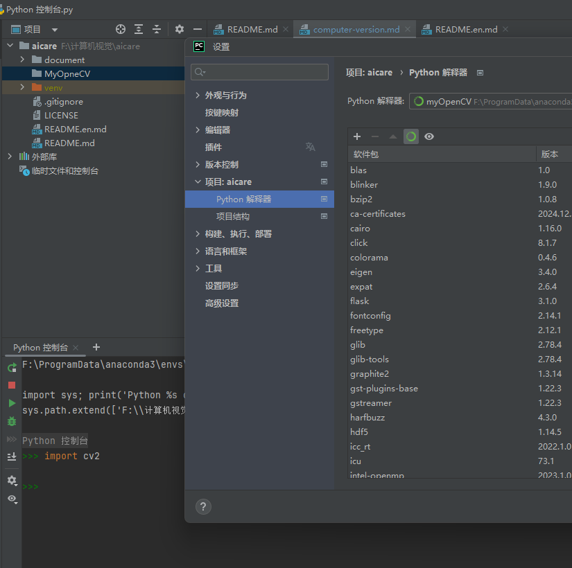

# 计算机视觉从零开始
## 简介
 前提
 电脑安装 anaconda、pycharm
 技术栈
 openCV、pytorch
## 安装openCV
方式一（推荐）：
使用anaconda安装

方式二：
此库完全开源 官网：https://opencv.org
github 地址 https://github.com/opencv/opencv/tree/4.10.0
下载地址：
1. https://opencv.org/releases/
2. https://github.com/opencv/opencv/releases
ps： github加速下载工具 https://github.akams.cn/

然后配置pycharm中的python版本，我这里是新建了一个env

 在python中执行
```bash
import cv2
```
没有报错，说明这个模型已经安装成功


