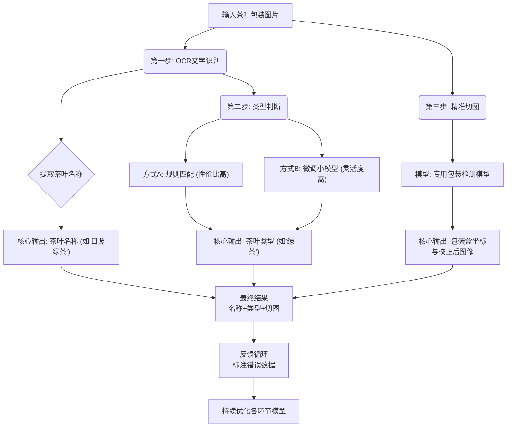

# 简介

## 流程图


## 代码结构
tea_recognition_project/
│
├── main.py                      # 主程序入口
├── config.py                    # 配置文件（API密钥、路径等）
│
├── core/                        # 核心模块
│   ├── __init__.py
│   ├── ocr_engine.py           # OCR引擎（PaddleOCR封装）
│   ├── tea_classifier.py       # 茶叶分类器（你的规则库）
│   └── package_detector.py     # 包装盒检测器（YOLO模型）
│
├── models/                      # 存放模型文件
│   ├── paddleocr/              # PaddleOCR模型（会自动下载）
│   └── yolo_tea_package/       # 训练好的YOLO模型
│       ├── weights/best.pt
│       └── data.yaml
│
├── data/                        # 数据目录
│   ├── raw_images/             # 原始茶叶图片
│   ├── annotated/              # 标注后的数据（用于YOLO训练）
│   └── error_cases/            # 识别错误的案例（用于迭代）
│
├── scripts/                     # 实用脚本
│   ├── train_yolo.py           # YOLO训练脚本
│   └── label_images.py         # 图片标注助手脚本
│
└── requirements.txt             # 项目依赖

## 使用教程
### paddleocr
paddle使用3.3.0  paddleocr要用3.2.0
注意事项：要按照官方教程。并且如果numpy报错，换版本1.26.0。
https://github.com/PaddlePaddle/PaddleOCR/blob/main/readme/README_cn.md

```shell
conda create -n tea --override-channels -c https://mirrors.tuna.tsinghua.edu.cn/anaconda/pkgs/main/ python=3.10
conda activate tea

python -m pip install paddlepaddle==3.2.0 -i https://www.paddlepaddle.org.cn/packages/stable/cpu/
python -m pip install paddlepaddle-gpu==3.2.0 -i https://www.paddlepaddle.org.cn/packages/stable/cu126/
python -c "import paddle; print(paddle.__version__)"
python -m pip install paddleocr -i https://mirrors.aliyun.com/pypi/simple/
```

## 未来改进
核心思路：从“识别所有文字”到“识别茶叶包装的文字”
方案A：基于规则过滤（5分钟见效，0训练成本）
原理：OCR检测出所有文本框 → 根据位置、大小、内容过滤 → 只保留茶叶包装区域的文字。
优点：立即生效，零成本
缺点：如果茶叶包装在顶部位置，会被误删

方案B：基于版面分析（30分钟配置，规则+视觉）
原理：先找“包装盒整体”，再找“包装盒内的文字”。

优点：物理隔离，确保只处理包装盒内文字
缺点：如果包装盒与背景对比度低，可能找不准

方案D：关键信息提取（KIE）- 终极方案
让模型直接告诉你“哪个文本框是茶叶名称”。

今天就能做的：

方案A：写20行过滤规则，立马见效

方案B：轮廓检测找包装盒，30分钟配置

本周可以做的：
3. 方案C：标注30张图，训练检测模型，1小时工作量

长期积累的：
4. 方案D：积累200张标注图，训练KIE模型，实现全自动提取
5. 
你不需要放弃PaddleOCR，也不需要去学YOLO。PaddleOCR本身就是一个完整的目标检测框架。

你遇到的问题（检测到多个文字区域）正是PaddleOCR检测模块要解决的问题。你只需要：

告诉模型“什么是茶叶包装”（标注30张图）

训练一个专属检测头（1小时）

永久解决噪声干扰问题

整个流程都在Paddle生态内，不用写一行YOLO代码，完全可商用。


