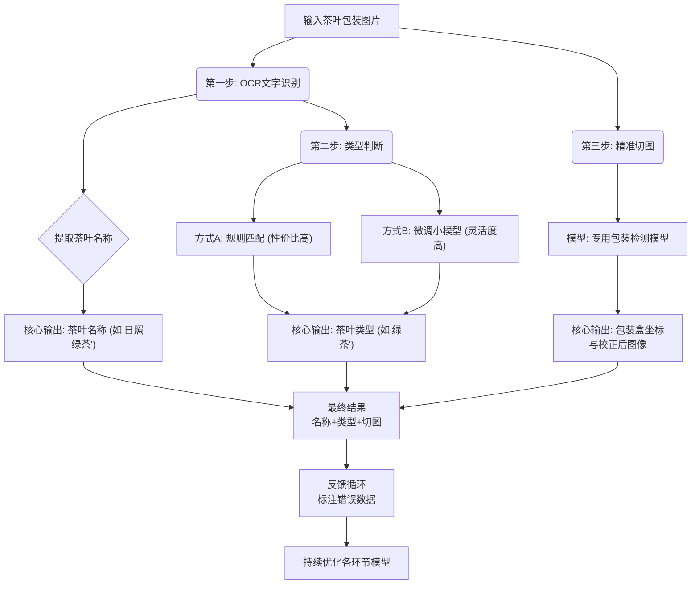

# 简介

## 流程图


## 代码结构
tea_recognition_project/
│
├── main.py                      # 主程序入口
├── config.py                    # 配置文件（API密钥、路径等）
│
├── core/                        # 核心模块
│   ├── __init__.py
│   ├── ocr_engine.py           # OCR引擎（PaddleOCR封装）
│   ├── tea_classifier.py       # 茶叶分类器（你的规则库）
│   └── package_detector.py     # 包装盒检测器（YOLO模型）
│
├── models/                      # 存放模型文件
│   ├── paddleocr/              # PaddleOCR模型（会自动下载）
│   └── yolo_tea_package/       # 训练好的YOLO模型
│       ├── weights/best.pt
│       └── data.yaml
│
├── data/                        # 数据目录
│   ├── raw_images/             # 原始茶叶图片
│   ├── annotated/              # 标注后的数据（用于YOLO训练）
│   └── error_cases/            # 识别错误的案例（用于迭代）
│
├── scripts/                     # 实用脚本
│   ├── train_yolo.py           # YOLO训练脚本
│   └── label_images.py         # 图片标注助手脚本
│
└── requirements.txt             # 项目依赖

## 使用教程
### paddleocr
注意事项：要按照官方教程。并且如果numpy报错，换版本1.26.0。
https://github.com/PaddlePaddle/PaddleOCR/blob/main/readme/README_cn.md

```shell
conda create -n tea --override-channels -c https://mirrors.tuna.tsinghua.edu.cn/anaconda/pkgs/main/ python=3.9

python -m pip install paddlepaddle==3.2.0 -i https://www.paddlepaddle.org.cn/packages/stable/cpu/

python -m pip install paddleocr
```