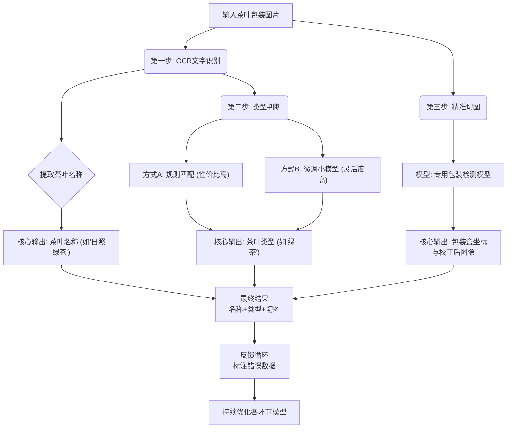

# 简介

## 流程图

```mermaid

flowchart TD
    A[输入茶叶包装图片] --> B(第一步: OCR文字识别)
    B --> C{提取茶叶名称}
    C --> D["核心输出: 茶叶名称 (如'日照绿茶')"]
    
    B --> E(第二步: 类型判断)
    E --> F["方式A: 规则匹配 (性价比高)"]
    E --> G["方式B: 微调小模型 (灵活度高)"]
    F & G --> H["核心输出: 茶叶类型 (如'绿茶')"]
    
    A --> I(第三步: 精准切图)
    I --> J["模型: 专用包装检测模型"]
    J --> K["核心输出: 包装盒坐标<br>与校正后图像"]
    
    D & H & K --> L["最终结果<br>名称+类型+切图"]
    
    L --> M["反馈循环<br>标注错误数据"]
    M --> N["持续优化各环节模型"]
    
```
